<div align="center">

# 📧 AmbitiousYou Notifications Service

### Microservice for Email & Push Notifications

*A dedicated Express.js microservice handling all transactional email delivery for the AmbitiousYou ecosystem.*

[](https://expressjs.com/)
[](https://nodejs.org/)
[](https://typescriptlang.org/)
[](https://docker.com/)

[Main Application](https://github.com/hemants1703/AmbitiousYou) · [API Reference](#-api-reference) · [Getting Started](#-getting-started)

</div>

---

## 🔗 Part of AmbitiousYou Ecosystem

This microservice is a component of the **AmbitiousYou** goal-tracking platform. It handles all notification delivery, keeping the main application focused on business logic.

| Repository | Description |
|------------|-------------|
| [**AmbitiousYou**](https://github.com/hemants1703/AmbitiousYou) | Main Next.js application (UI, Auth, Business Logic) |
| **This Repo** | Notifications microservice (Email, Future: PWA Push) |

---

## 🏗️ System Architecture


---

## 🔄 Email Delivery Flow

```mermaid
sequenceDiagram
    autonumber
    participant App as 📦 Main App
    participant Notif as 📧 This Service
    participant Zod as ✅ Zod Validator
    participant Template as 📄 HTML Template
    participant Mail as 📬 MailService
    participant SMTP as ☁️ SMTP Provider
    participant User as 👤 User

    App->>Notif: POST /api/email/send-*
    Notif->>Zod: Validate request body
    
    alt Invalid Request
        Zod-->>Notif: Validation errors
        Notif-->>App: 400 Bad Request
    end
    
    Zod-->>Notif: Valid data
    Notif->>Template: Load HTML template
    Template-->>Notif: Template with placeholders
    Notif->>Notif: Replace {{VARIABLES}}
    Notif->>Mail: sendEmail(options)
    Mail->>SMTP: Send via Nodemailer
    SMTP-->>Mail: Message ID
    Mail-->>Notif: Success
    Notif-->>App: 200 OK
    SMTP->>User: 📬 Email delivered
```



---

## ✨ Features

### Current Capabilities

| Feature | Description |
|---------|-------------|
| 📧 **Transactional Emails** | Welcome, verification, password reset emails |
| 🎨 **HTML Templates** | Beautiful, responsive email templates |
| ✅ **Input Validation** | Zod schemas for all API requests |
| 🔌 **REST API** | Clean, documented endpoints |
| 🐳 **Docker Ready** | Containerized for easy deployment |
| 🔄 **Hot Reload** | `tsx watch` for development |

### Notification Types

```mermaid
graph LR
    subgraph Triggers["🎯 Triggers"]
        Signup["User Signup"]
        Login["Email Verification"]
        ForgotPW["Forgot Password"]
        ResetPW["Password Reset"]
        UpdatePW["Password Update"]
    end

    subgraph Endpoints["📡 API Endpoints"]
        E1["/send-welcome"]
        E2["/send-email-verification"]
        E3["/send-password-reset-link"]
        E4["/send-password-reset-confirmation"]
        E5["/send-password-update-confirmation"]
    end

    subgraph Templates["📄 Templates"]
        T1["signup-welcome.html"]
        T2["verify-email.html"]
        T3["password-reset.html"]
        T4["password-reset-verification-update.html"]
        T5["password-update-confirmation.html"]
    end

    Signup --> E1 --> T1
    Login --> E2 --> T2
    ForgotPW --> E3 --> T3
    ResetPW --> E4 --> T4
    UpdatePW --> E5 --> T5
```



### Future Roadmap

- [ ] PWA Push Notifications (service worker integration)
- [ ] Scheduled notifications (deadline reminders)
- [ ] Progress check-in notifications

---

## 📁 Project Structure

```mermaid
graph TD
    subgraph Root["📂 ambitiousyou-notifications-service"]
        Server["server.ts<br/>(Entry Point)"]
        
        subgraph Src["src/"]
            subgraph RoutesDir["routes/"]
                MR["mailRoutes.ts"]
                PR["pwaPushNotificationRoutes.ts"]
            end
            
            subgraph ControllersDir["controllers/"]
                MC["mailController.ts"]
                PC["pwaController.ts"]
            end
            
            subgraph ServicesDir["services/"]
                MS["mailService.ts"]
            end
            
            subgraph ValidatorsDir["validators/"]
                MV["mailValidators.ts"]
            end
            
            subgraph StaticDir["static/"]
                SW["signup-welcome.html"]
                VE["verify-email.html"]
                PWR["password-reset.html"]
                PWRV["password-reset-verification-update.html"]
                PWUC["password-update-confirmation.html"]
            end
        end
        
        Dockerfile["Dockerfile"]
        Package["package.json"]
    end

    Server --> RoutesDir
    MR --> MC
    MC --> MS
    MC --> MV
    MC --> StaticDir
```



---

## 📡 API Reference

### Base URL

```
http://localhost:3001/api/email
```

### Endpoints Overview

```mermaid
graph LR
    subgraph API["📡 API Endpoints"]
        Health["GET /health"]
        Send["POST /send"]
        Welcome["POST /send-welcome"]
        Verify["POST /send-email-verification"]
        ResetLink["POST /send-password-reset-link"]
        ResetConfirm["POST /send-password-reset-confirmation"]
        UpdateConfirm["POST /send-password-update-confirmation"]
    end

    subgraph Required["Required Fields"]
        Health --- R0["None"]
        Send --- R1["to, subject, text, html"]
        Welcome --- R2["to, username"]
        Verify --- R3["to, username, verificationLink"]
        ResetLink --- R4["to, username, passwordResetLink"]
        ResetConfirm --- R5["to, username"]
        UpdateConfirm --- R6["to, username"]
    end
```



---

#### Health Check

```http
GET /health
```

**Response:**
```json
{
  "status": "ok",
  "message": "Server is running"
}
```

---

#### Send Custom Email

```http
POST /api/email/send
```

**Request Body:**
```json
{
  "to": "user@example.com",
  "subject": "Your Subject",
  "text": "Plain text version",
  "html": "<h1>HTML version</h1>"
}
```

---

#### Send Welcome Email

```http
POST /api/email/send-welcome
```

**Request Body:**
```json
{
  "to": "user@example.com",
  "username": "John"
}
```

---

#### Send Email Verification

```http
POST /api/email/send-email-verification
```

**Request Body:**
```json
{
  "to": "user@example.com",
  "username": "John",
  "verificationLink": "https://app.ambitiousyou.com/verify?token=..."
}
```

---

#### Send Password Reset Link

```http
POST /api/email/send-password-reset-link
```

**Request Body:**
```json
{
  "to": "user@example.com",
  "username": "John",
  "passwordResetLink": "https://app.ambitiousyou.com/reset?token=..."
}
```

---

#### Send Password Reset Confirmation

```http
POST /api/email/send-password-reset-confirmation
```

**Request Body:**
```json
{
  "to": "user@example.com",
  "username": "John"
}
```

---

#### Send Password Update Confirmation

```http
POST /api/email/send-password-update-confirmation
```

**Request Body:**
```json
{
  "to": "user@example.com",
  "username": "John"
}
```

---

### Error Responses

All endpoints return validation errors in this format:

```json
{
  "message": "Validation error message",
  "errors": {
    "fieldName": ["Error details"]
  }
}
```

---

## 🛠️ Tech Stack

| Technology | Version | Purpose |
|------------|---------|---------|
| **Node.js** | 22 | Runtime environment |
| **Express.js** | 5.x | Web framework |
| **TypeScript** | Latest | Type safety |
| **Nodemailer** | 7.x | Email delivery |
| **Zod** | 4.x | Request validation |
| **tsx** | Latest | TypeScript execution & hot reload |
| **pnpm** | 10.x | Package manager |

---

## 🚀 Getting Started

### Prerequisites

- Node.js 20+
- pnpm (`npm install -g pnpm`)
- SMTP credentials (Gmail, Azure, etc.)

### Installation

```bash
# Clone the repository
git clone https://github.com/hemants1703/ambitiousyou-notifications-service.git
cd ambitiousyou-notifications-service

# Install dependencies
pnpm install

# Set up environment variables
cp .env.example .env

# Start development server (with hot reload)
pnpm dev
```

### Environment Variables

```env
# Server
PORT=3001

# Email Provider (SMTP)
EMAIL_HOST=smtp.gmail.com
EMAIL_PORT=465
EMAIL_USER=your-email@gmail.com
EMAIL_PASS=your-app-password

# Frontend URL (for email links)
FRONTEND_URL=http://localhost:3000
```

> 💡 **Gmail Users**: Use an [App Password](https://support.google.com/accounts/answer/185833) instead of your regular password.

---

## 🐳 Docker Deployment

### Build Image

```bash
docker build -t ambitiousyou-notifications .
```

### Run Container

```bash
docker run -d \
  -p 3001:3001 \
  -e EMAIL_HOST=smtp.gmail.com \
  -e EMAIL_PORT=465 \
  -e EMAIL_USER=your-email@gmail.com \
  -e EMAIL_PASS=your-app-password \
  -e FRONTEND_URL=https://your-app.com \
  ambitiousyou-notifications
```

### Docker Compose (with Main App)

```yaml
version: '3.8'
services:
  notifications:
    build: ./ambitiousyou-notifications-service
    ports:
      - "3001:3001"
    environment:
      - EMAIL_HOST=smtp.gmail.com
      - EMAIL_PORT=465
      - EMAIL_USER=${EMAIL_USER}
      - EMAIL_PASS=${EMAIL_PASS}
      - FRONTEND_URL=http://app:3000
```

---

## 📧 Email Template Preview

During development, you can preview email templates at:

```
http://localhost:3001/preview/
```

Available templates:
- `/preview/signup-welcome.html`
- `/preview/verify-email.html`
- `/preview/password-reset.html`
- `/preview/password-reset-verification-update.html`
- `/preview/password-update-confirmation.html`

---

## 🔄 Integration with Main App

The main AmbitiousYou application communicates with this service via the `EmailService` client:

```typescript
// In AmbitiousYou main app: src/services/emailService.ts
export class EmailService {
  async sendEmailVerificationLink({ to, username, link }) {
    await fetch(`${process.env.MAIL_SERVICE_BASE_URL}/send-email-verification`, {
      method: "POST",
      headers: { "Content-Type": "application/json" },
      body: JSON.stringify({ to, username, verificationLink: link }),
    });
  }
  // ... other methods
}
```

Configure the main app to point to this service:

```env
# In AmbitiousYou main app .env
MAIL_SERVICE_BASE_URL=http://localhost:3001/api/email
```

---

## 🎯 Why a Separate Microservice?

```mermaid
graph TB
    subgraph Benefits["✅ Benefits of This Architecture"]
        B1["🔀 Separation of Concerns<br/>Main app focuses on business logic"]
        B2["📈 Independent Scaling<br/>Scale email service separately"]
        B3["🔌 Technology Flexibility<br/>Swap providers without touching main app"]
        B4["🚀 Future Extensibility<br/>Easy to add PWA push, SMS, etc."]
        B5["🧪 Simplified Testing<br/>Test email functionality in isolation"]
        B6["🔒 Security Isolation<br/>Email credentials isolated from main app"]
    end
```



| Benefit | Explanation |
|---------|-------------|
| **Separation of Concerns** | Main app focuses on business logic, this handles notifications |
| **Independent Scaling** | Scale notification service separately during high email volume |
| **Technology Flexibility** | Can swap email providers without touching main app |
| **Future Extensibility** | Easy to add PWA push, SMS, or other notification channels |
| **Simplified Testing** | Test email functionality in isolation |

---

## 📄 License

This project is licensed under the **MIT License** — see the [LICENSE](LICENSE) file for details.

---

<div align="center">

**Part of the [AmbitiousYou](https://github.com/hemants1703/AmbitiousYou) ecosystem**

Built with ❤️ by [Hemant Sharma](https://hemantsharma.tech)

[LinkedIn](https://linkedin.com/in/hemants1703) · [Twitter](https://x.com/hemants1703) · [Portfolio](https://hemantsharma.tech)

</div>
